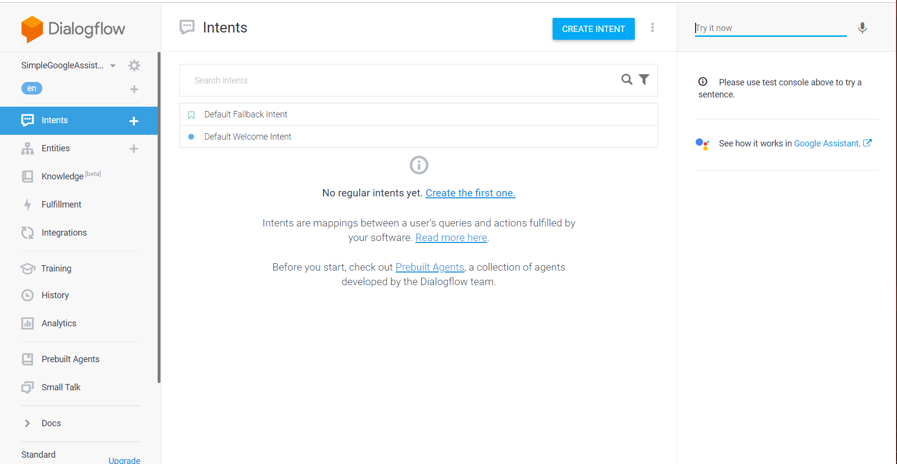

# Node.js-Google-Assistant
Simple Google Assistant Development using Node.js

## Introduction
Google provides many facilities with Google Assistant as easy-integrated with platforms, developing with different languages, engaging voice and text-based conversational.

>There are three base platforms to develop and deploy assistant,
> * Dialogflow (Platform that Creating Chatbot and Setting "Intent ,Entities")
> * Actions On Google (Manage and connect your services and assistant settings)
> * Firebase (Assistant Functions deploy on Firebase to get request)(Optional).

*This project and documentation contains informations about Google Assistant Development Cycle.*

## Dialogflow
Dialogflow is a platform to create chatbot and setting Intent and Entities. With Natural Language Processing (NLP) algoritm in Dialoglow , chatbot can understand easily what do you want to say.
Firstly , let's explain Dialogflow concepts with images and more details. 
Login [Dialogflow](https://dialogflow.com/) with your google account and then click the create agent. After sets the assistant, you will see this screen:

**Intents** are simple messaging objects that describe how to do something [You can find here](https://developers.google.com/actions/reference/rest/intents).
There are two Default Intent in chatbot, "Default Welcome Intent" and "Default Fallback Intent". I can explain easily Intents and Intents feature with simple example. 

Assistant and user play a game each other, Assistant keeps a number between 0-10 and user tries to guess with three rights. Assistant catches the request with **"guess_number"** intent. Add possible messages to the  **"Training phrases"** in "guess_number" intent like "My guess number is 5" or "number is 3". 

When the user make a mistake guess, user's right should decrease. 

 
