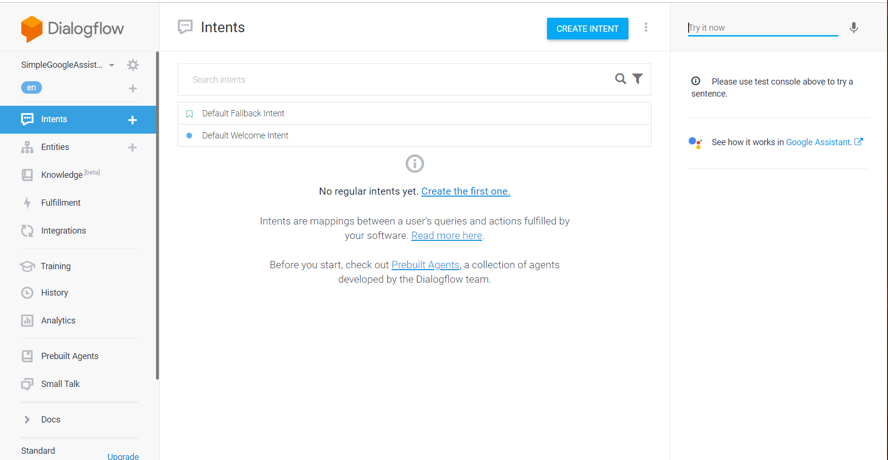
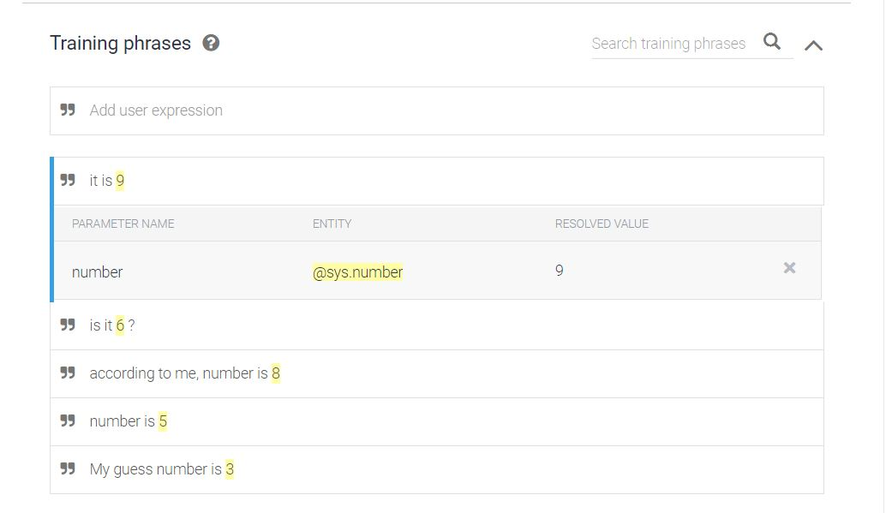
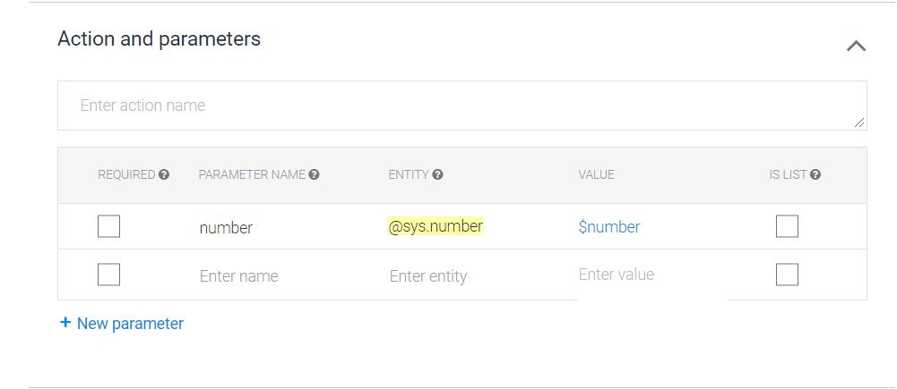
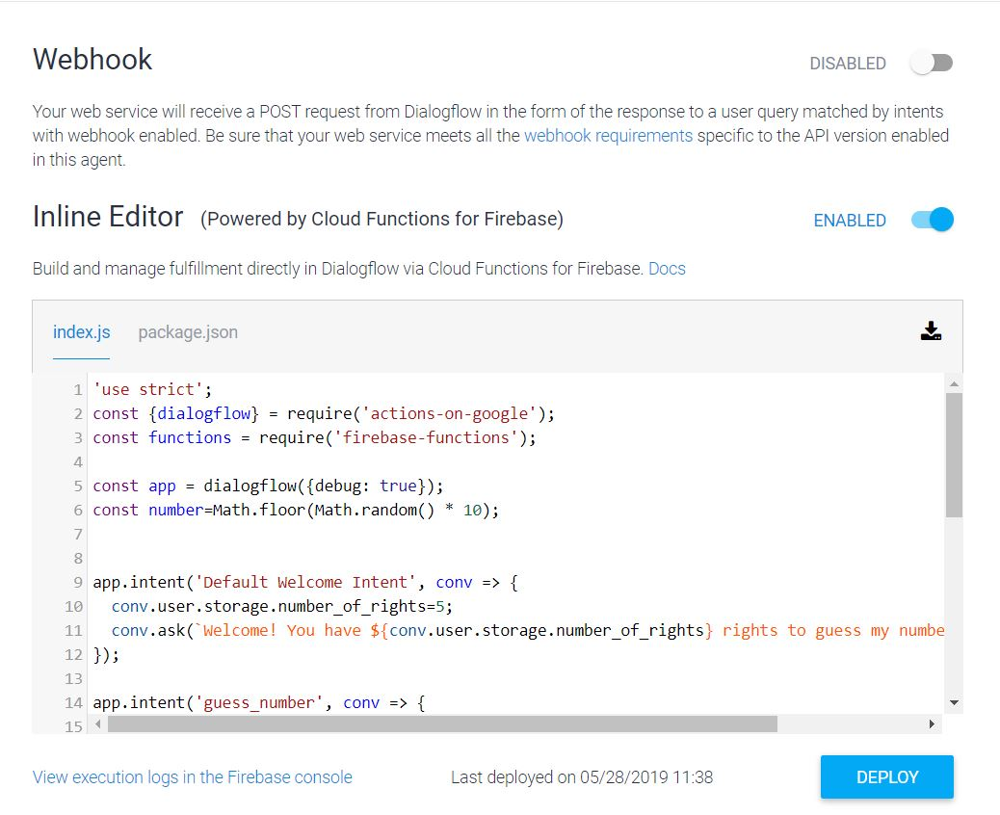
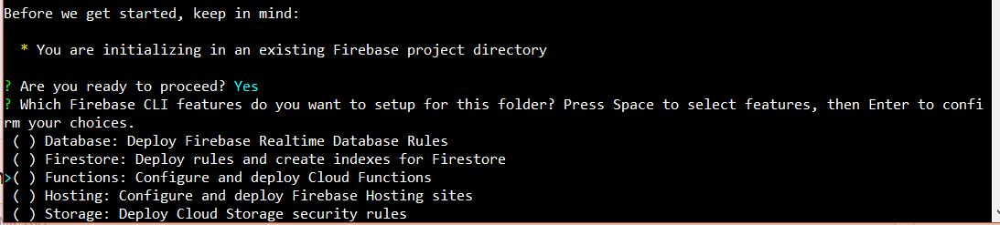
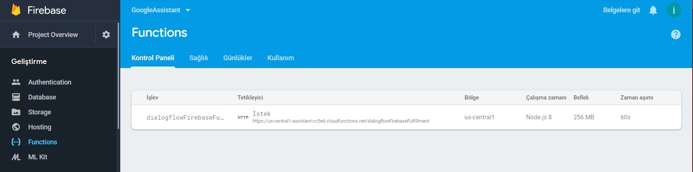
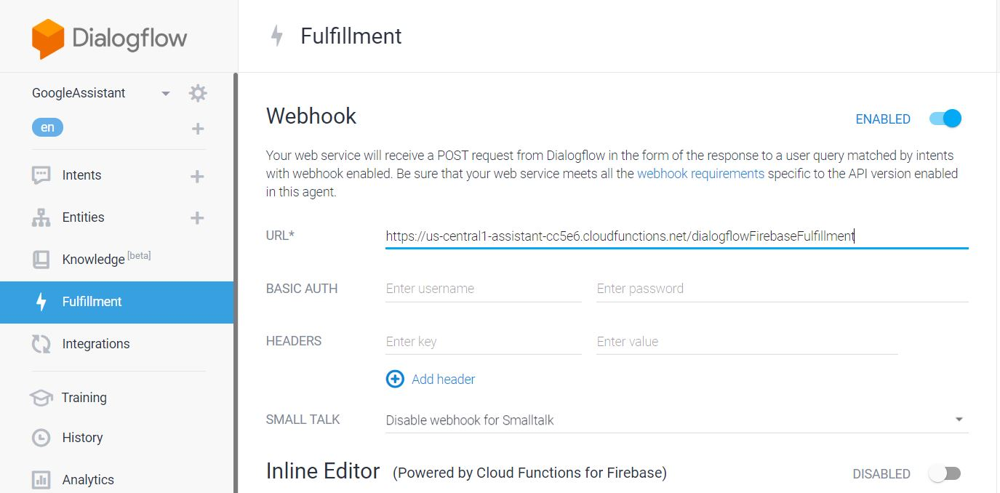

# Node.js-Google-Assistant
Simple Google Assistant Development using Node.js

## Introduction
Google provides many facilities with Google Assistant as easy-integrated with platforms, developing with different languages, engaging voice and text-based conversational.

>There are three base platforms to develop and deploy assistant,
> * Dialogflow (Platform that Creating Chatbot and Setting "Intent ,Entities")
> * Actions On Google (Manage and connect your services and assistant settings)
> * Firebase (Assistant Functions deploy on Firebase to get request)(Optional).

*This project and documentation contains informations about Google Assistant Development Cycle.*

## Dialogflow
Dialogflow is a platform to create chatbot and setting Intent and Entities. With Natural Language Processing (NLP) algoritm in Dialoglow , chatbot can understand easily what do you want to say.
Firstly , let's explain Dialogflow concepts with images and more details. 
Login [Dialogflow](https://dialogflow.com/) with your google account and then click the create agent. After sets the assistant, you will see this screen:



**Intents** are simple messaging objects that describe how to do something [You can find here](https://developers.google.com/actions/reference/rest/intents).
There are two Default Intent in chatbot, *"Default Welcome Intent"* and *"Default Fallback Intent"*. I can explain easily Intents and Intents feature with simple example. 

Assistant and user play a game each other, Assistant keeps a number between 0-10 and user tries to guess with three rights. Assistant catches the request with **"guess_number"** intent. Add possible messages to the  **"Training phrases"** in "guess_number" intent like *"My guess number is 5"* or *"number is 3"*. 

When the user make a mistake guess, assistant should decrease the number of rights so to do that, assistant uses [**User storage**](https://developers.google.com/actions/assistant/save-data). There is simple piece of code example , 

```javascript
app.intent('Default Welcome Intent', conv => {
  conv.user.storage.number_of_rights=5;
  conv.ask(`Welcome! You have ${conv.user.storage.number_of_rights} rights to guess my number. Say a number.`);
});
```
**How can the Assistant catch the *number* in request ?**
Assistant uses **entities** to catch specific value in the request. For this example, assistant needs a *number* and there is already  *sys.number* entity defined by default. Entities seems as,




To reach these values in backend, *conv.parameters.PARAMATER_NAME* is used.

```javascript
app.intent('guess_number', conv => {
 console.log('guess : ',conv.parameters.number);
  if(conv.parameters.number==number){
     conv.ask('That is right. Thanks');
     }
......
```
After adding intent , entities and necessary code blocks; every wrong guess, assistant decrease the *conv.user.storage.number_of_rights*.

There are two ways to deploy a assistant. If you click Fulfillment tab, you can see this screen. 


Inline editor is online development enviroment. *Just type your code and deploy.*
If you have a web service that listen to request from dialogflow, you can type service url and dialogflow can speak to your service.
For this example, *firebase functions* are used so our assistant backend **deployed on firebase**.

## Actions On Google
Actions On Google is a developer platform that extends asisstant's functionalities, deploy assistant as a product for Alpha (up to 20 users), Beta (up to 200 users) or Production ,and sets general settings of assistant. At the same time, there is a simulator to test assistant on this platform. Another important thing in this platform is "Account Linking" and I will explain in another project. 

## Firebase
Firebase is a development enviroment that has many services as *Real Time Database*,*Hosting*,*Cloud Messaging*,*Storage*,*Hosting*, *Functions*. In this project, *Firebase Functions* is used to deploy assistant. Let's explain deploy assistant to the firebase functions. 

Clone this project, then open command line and install firebase tools with this code.
```bash
npm i firebase-tools
```

Use this command to login your firebase account.
```bash
firebase login
```

Setup the Firebase feautres, execute this command, then select the functions with SPACEBAR.
```bash
firebase init
```


Deploy project and use [Firebase Console](https://firebase.google.com/) to manage your functions.
```bash
firebase deploy
```
To connect your assistant and firebase function, just copy and paste your functions deployed address to the assistant webhook.




Every thing is done, now your assistant is ready.


 
